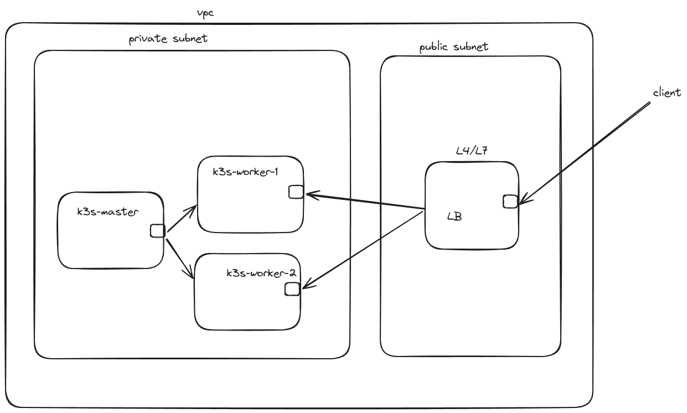
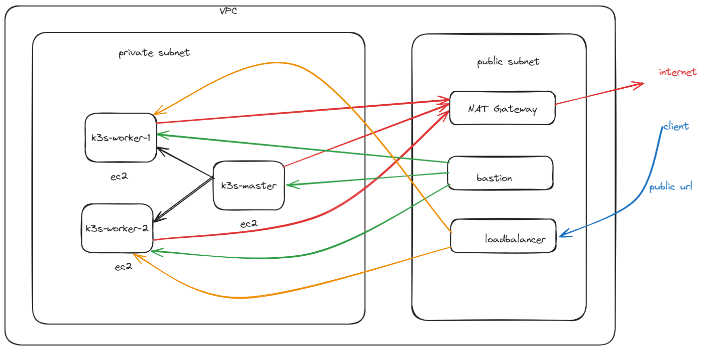

# Kubernetes with K3s and nginx in AWS
## Using Makefile for IaC

In this repo, I have created a Makefile to create 4 ec2 vm in AWS. 3 used for k3s and 1 for LoadBalancing with L7 nginx.
Among 3 k3s vm, one will be master and 2 will worker.

### Important
when configure aws using ```aws configure``` then output format must be **json**, otherwise **Makefile** will not work

Request will come to LB VM and from that vm request will forwarded into any two of the worker vm where the pod is running the application




After running the **Makefile**, it will save **.pem** file
Using **.pem** file, we can access the vm using ssh and we can configure kubectl to point to our k3s cluster using kubeconfig.

### kubeconfig
To get the kubeconfig, ssh into the k3s master vm. then run the below command
```bash
sudo cat /etc/rancher/k3s/k3s.yaml
```

now copy the output and in your local machine, create **.kube** folder in home directory. if it already exists then no need to create the folder
* for linux the location is ```/home/<user-name>```
* for windows the location is ```C:\Users\<user-name>```

inside the **.kube** folder create file name **config**, if it already exists, then no need to create it.

paste the copied text from k3s master to config file sothat kubectl can talk to master. if **config** file contains other cluster information, then added the content accordingly without override it

### issue

you may get certificate validation error, in that case you need to add **kubectl --insecure-skip-tls-verify** and run the command. for example
```bash
kubectl --insecure-skip-tls-verify get nodes
```

### Deploy demo app
To Deploy our demo app, just navigate to **manifests** folder and run
```bash
kubectl --insecure-skip-tls-verify apply -f .
```

it will create two deployment object and two nodeport service
in **/** we will get nginx welcome page and in **/api** we will see message **Hello Kubernetes**


### LB

Now, we need to ssh into LB ec2 vm and install docker to run the nginx container
```bash
sudo apt update
sudo apt install docker.io
```

then create a **Dockerfile** with below content
```Dockerfile
FROM nginx:latest

COPY nginx.conf /etc/nginx/nginx.conf

EXPOSE 80

CMD [ "nginx", "-g", "daemon off;" ]
```

and **nginx.conf**, must change the **upstream** block with worker vm private ip and yours service nodePort
```lua
worker_processes 1;

events {
    worker_connections 1024;
}

http {
    log_format main '$proxy_add_x_forwarded_for - $remote_user [$time_local] "$request" '
                      '$status $body_bytes_sent "$http_referer" '
                      '"$http_user_agent" "$http_x_forwarded_for"';

    access_log /var/log/nginx/access.log main;
    error_log /var/log/nginx/error.log debug;
    sendfile on;
    tcp_nopush on;
    tcp_nodelay on;
    keepalive_timeout 65;
    types_hash_max_size 2048;

    include /etc/nginx/mime.types;
    default_type application/octet-stream;

    server {
        listen 80;
        server_name _;

        location /api {
            proxy_pass http://backend_api;
            proxy_set_header Host $host;
            proxy_set_header X-Real-IP $remote_addr;
            proxy_set_header X-Forwarded-For $proxy_add_x_forwarded_for;
            proxy_set_header X-Forwarded-Proto $scheme;
        }

        location / {
            proxy_pass http://backend_fr;
            proxy_set_header Host $host;
            proxy_set_header X-Real-IP $remote_addr;
            proxy_set_header X-Forwarded-For $proxy_add_x_forwarded_for;
            proxy_set_header X-Forwarded-Proto $scheme;
        }
    }


    upstream backend_api {
        # port must be backend_api service nodeport
        server 10.10.1.214:30180 weight=1 max_fails=3 fail_timeout=30s;
        server 10.10.1.105:30180 weight=1 max_fails=3 fail_timeout=30s;
        # Add more backend servers if needed
    }

    upstream backend_fr {
        # port must be fr-service node port
        server 10.10.1.214:30170 weight=1 max_fails=3 fail_timeout=30s;
        server 10.10.1.105:30170 weight=1 max_fails=3 fail_timeout=30s;
        # Add more backend servers if needed
    }
}

```


After that in lb vm, create docker image and run it
```bash
sudo docker image build -t my-nginx .
sudo docker run -d -p 80:80 my-nginx
```

After that we you hit lb public ip to get response
```http://<public-ip>``` for nginx response
```http://<public-ip>/api``` for getting Hello message from golang service


## Using Terraform as IaC

Now we will use `Terraform` as IaC to create our resources. All the terraform code is in `IaC` folder with a `Makefile` to run different terraform command.

we will create below resources

* 1 VPC
* 2 subnet, one public and another private
* 1 IGW
* 1 NAT Gateway
* 5 EC2 (3 for k3s{1-master, 2-worker}, 1 for lb, 1 for bastion)
* security groups

Our architecture diagram is



To deploy to AWS first install `aws cli` and configure it
```bash
aws configure
```

Navigate to `IaC` folder and run `Makefile` to perform `init`, `plan`, `apply`

To initialize the terraform module
```bash
make tf_dev_init
```

To run terraform plan
```bash
make tf_dev_plan
```

To create the resources
```bash
make tf_dev_apply
```

When we create our resources, it will create `k3s-key.pem` file, we need to copy that in `bastion` vm

Now, out of 5 vms, 2 has public ip and 3 doesn't have. 
One of the public vm will act as `bastion`.

So connect to bastion by clicking on `Connect`

in the `bastion` vm. run `sudo apt update`

From the bastion, we will connect to 3 private vm using our ssh-key `k3s-key.pem`

first ssh into our `k3s-master` private vm
```bash
ssh -i k3s-key.pem ubuntu@<private ip>
```
Now we install k3s master
```bash
sudo ufw disable && curl -sfL https://get.k3s.io | INSTALL_K3S_EXEC='--tls-san <MASTER_IP> --write-kubeconfig=/home/ubuntu/.kube/config --write-kubeconfig-mode=644' sh - 
```
please, replace `<MASTER IP>` with the current vm private ip

Now, copy the content of `.kube/config` from our k3s-master vm and save it somewhere, we need to use that later on

Also, run below command to get token, which is needed for woker node

```bash
sudo cat /var/lib/rancher/k3s/server/node-token
```
save the output in someother place

now exit the k3s-master vm. when you exit, you will return to basion host

In the bastion host install `kubectl`
```bash
 curl -LO "https://dl.k8s.io/release/$(curl -L -s https://dl.k8s.io/release/stable.txt)/bin/linux/amd64/kubectl"
 
 sudo install -o root -g root -m 0755 kubectl /usr/local/bin/kubectl
```
Now create a folder `.kube` in home directory and create file `config`
```bash
mkdir ~/.kube
nano ~/.kube/config
```

now paste the `config` value you copied from `k3s-master`
you need to change the following in `config` value

`server: https://127.0.0.1:6443` to `server: https://<master private ip>:6443`
 
otherwise, kubectl will not work. then save it. so we create `.kube/config` in bastion host, without basion host we can't deploy our application using `kubectl`

now, if we run 
```bash
kubectl get nodes
```
we will get one node i.e master node

Now, we install worker node. From bastion host ssh into two worker nodes and run the below command to create two woker nodes
```bash
sudo ufw disable && curl -sfL https://get.k3s.io | K3S_URL=https://<master private ip>:6443 K3S_TOKEN=<k3s-master-token> sh -s -
```

Now, from bastion host if we run `kubectl get nodes`, we will see, three nodes


### Deploy demo app
To Deploy our demo app, we need to copy **manifests** folder to bastion host. then in the bastion host, go to **manifests** folder and run
```bash
kubectl apply -f .
```

it will create two deployment object and two nodeport service.
in **/** we will get nginx welcome page and in **/api** we will see message **Hello Kubernetes**


For **LB**, you can follow the Makefile section it is same as before

just remember to change the ip address of worker node in **upstream** block in **nginx.conf** file